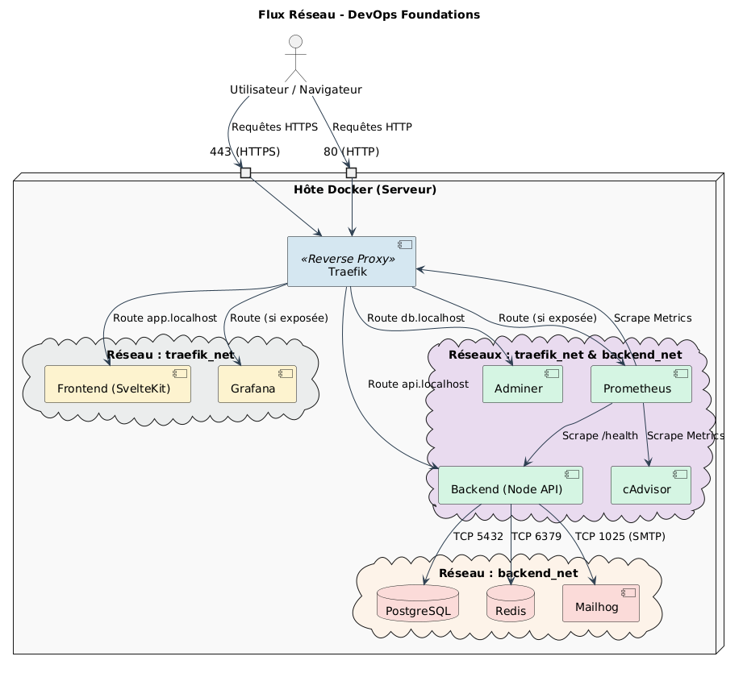

# Architecture Réseau et Documentation Traefik

Ce document présente l'architecture réseau mise en place pour le projet DevOps Foundations, détaille le fonctionnement de notre Reverse Proxy (Traefik) et justifie les choix faits en matière de sécurité de l'infrastructure.

## 1. Schéma détaillé des flux réseau

Voici le schéma d'architecture réseau modélisant la communication entre les différents conteneurs et les différents réseaux virtuels Docker (`traefik_net` et `backend_net`).

### Explication visuelle :
Le schéma met en évidence une séparation logique fine en **deux réseaux Docker isolés** :
*   **`traefik_net`** (Réseau "Front" / DMZ) : Permet à Traefik de communiquer avec les services qui doivent être accessibles depuis l'extérieur (le frontend, l'API backend et les interfaces d'administration/monitoring).
*   **`backend_net`** (Réseau "Back" / Privé) : Isole les bases de données (Postgres, Redis) et le service d'envoi d'e-mails (Mailhog). Seuls les services raccordés expressément à ce réseau (comme le Backend ou Adminer) peuvent interagir avec eux. **Traefik n'a aucun accès à la base de données.**

---

## 2. Fonctionnement de Traefik dans l'infrastructure

Traefik est un Edge Router moderne chargé de recevoir les requêtes du monde extérieur et de les distribuer aux bons conteneurs. Pour configurer son comportement de manière dynamique, notre stack utilise 4 concepts fondamentaux :

### A. Providers (Fournisseurs)
Les Providers sont les mécanismes par lesquels Traefik "découvre" les services disponibles.
Dans notre projet, Traefik utilise deux providers simultanément (`--providers.docker=true` et `--providers.file.filename=/etc/traefik/dynamic.yml`) :
*   **Docker Provider** : Traefik écoute directement le démon Docker (`/var/run/docker.sock`). Dès qu'un nouveau conteneur démarre avec les bons labels (ex: `traefik.enable=true`), Traefik crée automatiquement la configuration pour router le trafic vers ce conteneur.
*   **File Provider** : Traefik lit également la configuration statique présente dans `dynamic.yml`. Cela nous permet de définir les configurations TLS (pour mkcert) et les middlewares statiques qui s'appliquent globalement, en dehors de la configuration purement Docker.

### B. Routers (Routeurs)
Les Routers connectent les requêtes entrantes aux services correspondants, en se basant sur des **règles**.
*   Par exemple, pour notre Backend, une règle est définie via un label Docker (virtuellement ou explicitement) : `Rule=Host("api.localhost")`. 
*   Lorsque vous visitez `https://api.localhost`, le Routeur capte cette requête spécifique. C'est également au niveau du Routeur qu'on précise que la liaison doit utiliser TLS pour le port 443.

### C. Services
Une fois la requête interceptée par le Routeur et filtrée par les Middlewares, elle est transmise à un *Service*.
*   Le "Service" dans l'écosystème Traefik se charge du **Load-Balancing** (répartition de charge).
*   Il pointe vers les adresses IP privées internes des conteneurs cibles fournies par le Docker Provider. Traefik résout par exemple le fait de distribuer les requêtes reçues pour le frontend vers le l'IP interner attribuée au conteneur `frontend` sur le port interne `3001`.

### D. Middlewares (Intermédiaires)
Avant qu'une requête n'atteigne sa cible (le Service), les Middlewares permettent de l'altérer ou de la bloquer. Nous en utilisons de plusieurs sortes :
*   **Redirection HTTP vers HTTPS** : Un middleware capture tout le trafic entrant sur le port HTTP (80) et le force en HTTPS (443) avec un statut `301 Moved Permanently`.
*   **Sécurisation Basic Auth** : Un middleware lit le fichier `/etc/traefik/htpasswd` pour protéger le dashboard interne de Traefik (sur le port `8082` ou une sous-route), obligeant l'utilisateur à saisir un login et mot de passe.
*   **Ajustement de Headers** : Traefik gère automatiquement certains headers de sécurité avant de propager la requête aux applications (HSTS, etc.).

---

## 3. Justification des choix de sécurité

La conception de cette architecture a suivi le principe du moindre privilège, garantissant un cloisonnement strict entre ce qui est public et ce qui doit rester privé.

1.  **Isolation par réseaux ponts (Bridge Networks)**
    *   La création d'un sous-réseau `backend_net` spécifique pour Redis et PostgreSQL garantit qu'**aucune requête externe ne peut atteindre les bases de données**. Par défaut, un conteneur non renseigné dans le réseau `backend_net` ne pourra même pas "pinger" ou scanner Postgres. Seul le service Backend Node.js peut émettre des requêtes SQL.
2.  **Exposition minimale des ports (Host Port Binding)**
    *   En l'état idéal d'une production stricte (sans le fichier `.override.yml`), seuls les ports `80` et `443` associés à Traefik sont liés aux ports de l'hôte distant (`ports: - "80:80"`).
    *   Les services métiers (ex: l'api Node.js qui démarre sur `3002`, SvelteKit sur `3001` ou Postgres sur `5432`) ne publient **aucun port sur la machine hôte**. Leurs ports ne clignotent qu'en interne et leurs adresses IP restent encapsulées dans Docker. *(Note: En environnement de développement, certains ports peuvent être exposés via `docker-compose.override.yml` pour le débogage local).*
3.  **Gestion de la terminaison TLS au niveau de l'Edge Proxy**
    *   Traefik réalise la "Termination TLS", c'est-à-dire qu'il s'occupe de chiffrer/déchiffrer les certificats générés par `mkcert`.
    *   Cela allège le Frontend et le Backend qui communiquent en HTTP clair ("non chiffré") mais de manière sécurisée en raison de l'isolation du réseau Docker `traefik_net`. Cette mécanique centralise et favorise le recylement des certificats sans avoir à repenser le code des APIs de l'application.
4.  **Protection de l'interface d'administration Traefik**
    *   Traefik offre une vision complète sur l'état de l'infrastructure, ce qui justifie sa criticité. Son accès nécessite impérativement une authentification Basic Auth générée dynamiquement durant le run du `Makefile`, via montage de volume en `read-only` (`ro`). Le conteneur compromis ne pourrait ainsi pas réécrire le mot de passe local.
5.  **Utilisation restreinte des privilèges pour Base de données**
    *   Bien qu'étant des bases isolées, nous définissons des mots de passes explicites via l'environnement local (`.env`) au démarrage, évitant ainsi un profil vide non sécurisé si une faille de réseau venait à ouvrir le sous-réseau. De plus, Postgres et Redis tournent sur des images `alpine`, réduisant drastiquement la surface d'attaque en enlevant les utilitaires non vitaux du système embarqué.