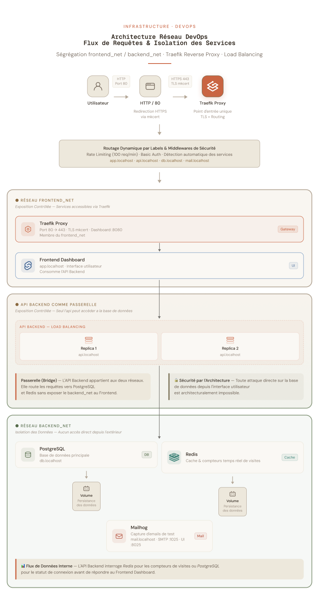

# Documentation Réseau et Sécurité – CloudNative Labs
## 1. Schéma détaillé des flux réseau

L'architecture repose sur une isolation stricte des flux pour limiter la surface d'attaque. Le trafic externe arrive exclusivement via Traefik sur les EntryPoints standards : le port **80 (web)**, qui redirige automatiquement vers le port **443 (websecure)** pour garantir un chiffrement de bout en bout via **TLS**.

**Réseau frontend_net (Zone d'exposition)** : Ce réseau contient Traefik, le Frontend et le Backend. Traefik fait le pont entre Internet et ces services.

**Réseau backend_net (Zone isolée)**: Ce réseau privé contient le Backend, la base de données PostgreSQL, le cache Redis et MailHog.

**Isolation critique** : Conformément aux exigences, la base de données et le cache ne sont pas présents sur le réseau frontend. Seul le service Backend possède une "double patte" (interface sur les deux réseaux), agissant comme une passerelle sécurisée pour l'application.

## 2. Fonctionnement de Traefik v3

Traefik agit comme un **Edge Router** et un **Load Balancer** dynamique. Son fonctionnement repose sur quatre composants clés :

- **Providers** : Ce sont les sources qui fournissent la configuration à Traefik (Docker, Kubernetes, ou un fichier). Dans notre projet, le Docker Provider scanne l'API Docker pour détecter les conteneurs grâce à leurs labels.

- **Routers** : Ils analysent les requêtes entrantes et utilisent des règles (ex: Host('api.localhost')) pour déterminer vers quel service diriger le trafic.

- **Services** : Ils définissent les destinations finales où les requêtes sont transmises. C'est ici que s'opère le load balancing automatique, par exemple en répartissant la charge entre les 2 replicas du backend.

- **Middlewares** : Ce sont des "douaniers" qui traitent la requête avant qu'elle n'atteigne le service. Ils appliquent des filtres comme le Rate Limiting, la Basic Auth ou la compression Gzip.
Traefik sépare la configuration statique (définie au démarrage : ports, providers) de la configuration dynamique (règles de routage et middlewares, modifiables sans redémarrage).

## 3. Justification des choix de sécurité

La sécurité de l'infrastructure est construite selon le principe de défense en profondeur :

- **Zéro Exposition directe** : Aucun conteneur, à l'exception de Traefik, n'expose de port sur la machine hôte. Cela empêche tout accès non autorisé aux bases de données ou aux APIs internes.

- **Chiffrement TLS** : L'utilisation de mkcert permet d'avoir des communications cryptées en local, simulant une production réelle où les données sensibles ne circulent jamais en clair.

- **Isolation des Processus (Namespaces)** : Chaque service est un processus isolé par le noyau Linux via des Namespaces (visibilité) et des Cgroups (limitation des ressources CPU/RAM).

- **Utilisateur Non-Root** : Tous les conteneurs (Frontend/Backend) tournent avec un utilisateur non-privilégié (UID/GID 1001). Même en cas de compromission du conteneur, l'attaquant n'aura pas les droits root sur l'hôte.

- **Middlewares de Sécurité** :
    **Rate Limiting (100 req/min)** : Protège l'API contre les attaques par déni de service (DoS).
    **Basic Auth** : Sécurise l'accès aux interfaces sensibles comme le Dashboard Traefik et l'administration des bases de données.
    **Headers de sécurité** : L'injection de headers comme HSTS ou X-Frame-Options renforce la protection du navigateur contre le clickjacking et d'autres vulnérabilités web.
